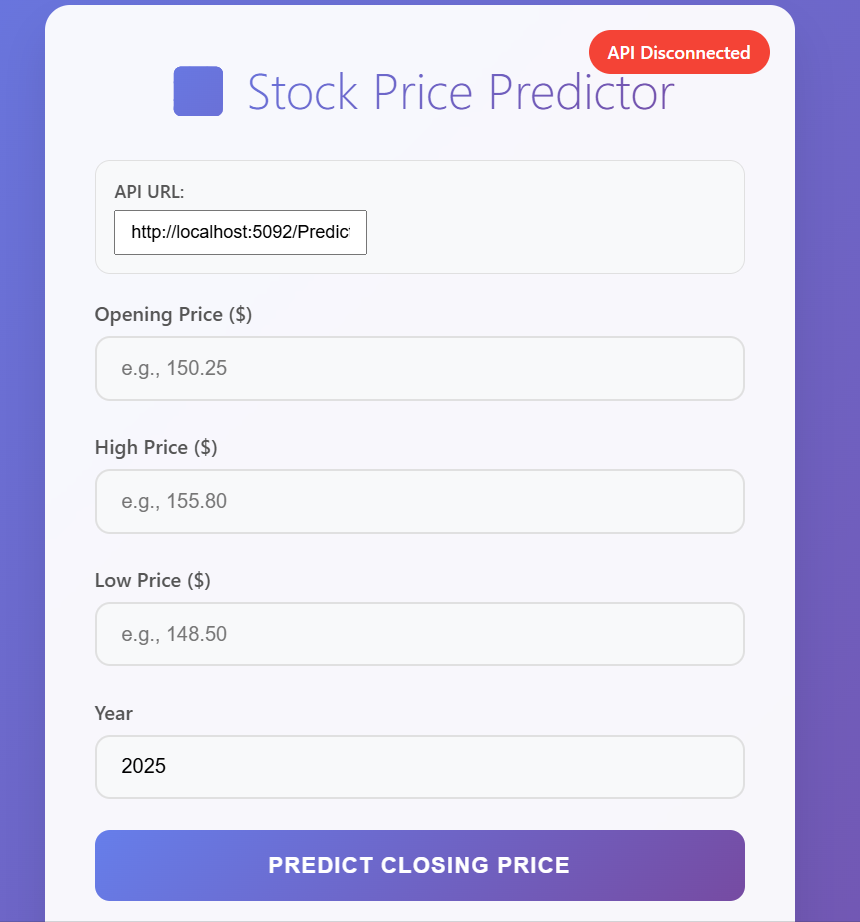
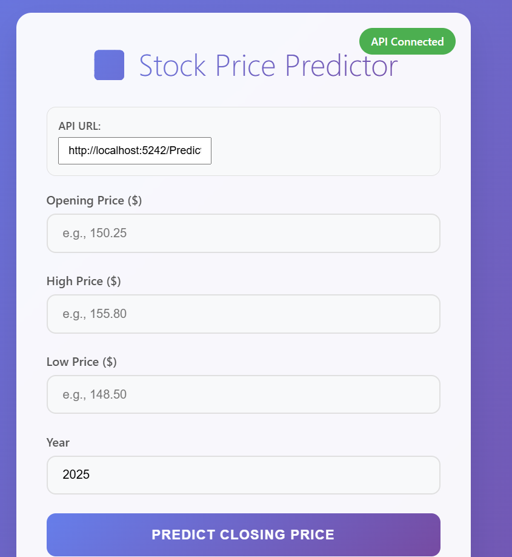
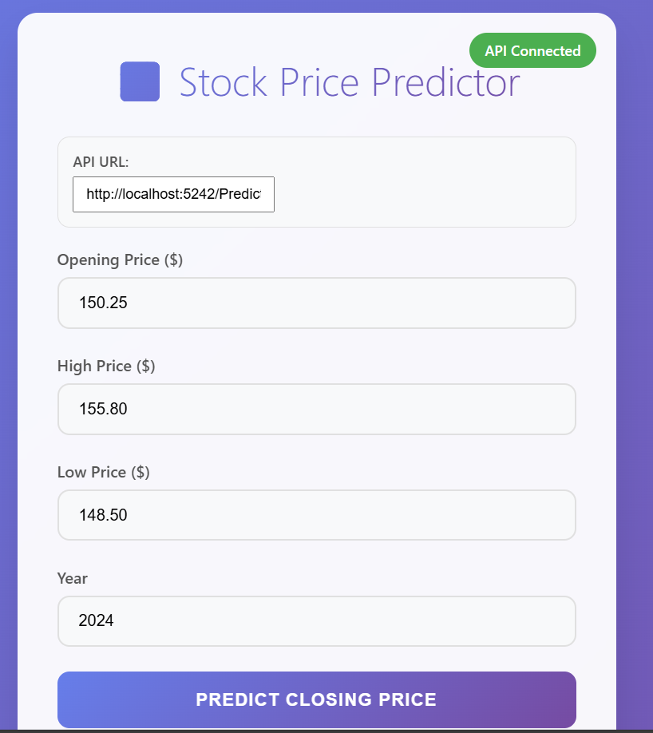
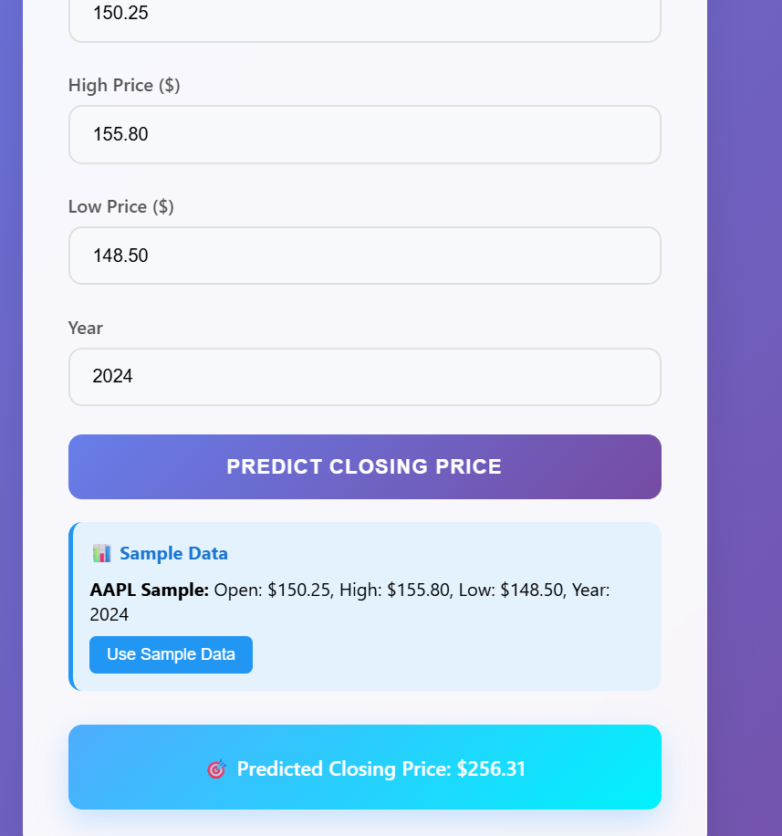

# AspStockPrediction:Stock Prediction API

AspStockPrediction is  RESTful API built with ASP.NET Core that predicts stock closing prices using machine learning models. The API uses ONNX Runtime to serve models trained with Python's scikit-learn.

## 🚀 Features

- **Real-time Stock Price Prediction**: Predict closing prices based on Open, High, Low, and Year values
- **ONNX Model Support**: Seamlessly use Python-trained scikit-learn models in .NET
- **RESTful API**: Clean, well-documented endpoints
- **Cross-Origin Support**: CORS enabled for frontend integration
- **Robust Error Handling**: Comprehensive error responses
- **Scalable Architecture**: Service-based design pattern

## 🛠️ Tech Stack

- **Backend**: ASP.NET Core 9.0
- **ML Framework**: ONNX Runtime
- **Language**: C#
- **Model Format**: ONNX (converted from Python scikit-learn)
- **IDE**: Visual Studio Code

## 📋 Prerequisites

- [.NET 9 SDK](https://dotnet.microsoft.com/download/dotnet/9.0)
- Visual Studio Code (recommended)

## 🏗️ Installation

### 1. Clone the Repository

```bash
git clone https://github.com/Biddhan/AspStockPrediction.git
cd AspStockPrediction
```

### 2. Project Structure

```
AspStockPrediction/
├── Controllers/
│   └── PredictionController.cs
├── Models/
│   └── StockInput.cs
├── MlModels/
│   ├── scaler.onnx
│   └── linear_regression_model.onnx
├── Program.cs
├── appsettings.json
└── README.md
```
## 🚀 Usage

### 1. Running the API

```bash
# Development mode
dotnet run

# Or with hot reload
dotnet watch 
```


### 2. Using the Frontend

A simple HTML frontend is provided to test the stock prediction API.

1. Open the `index.html` file located in the `frontend/` directory.
<br><br>

<br><br>
2. Enter the API endpoint  typically run at: `http://localhost:5242/Prediction/predict `
<br><br>

<br><br>
3. Enter stock input values such as `Open`, `High`, `Low`, and `Year`.
<br><br>

<br><br>
4. Click the **PREDICT CLOSING PRICE** button.
<br><br>

<br><br>
5. The frontend  makes a request to the API and display the predicted closing price.
<br><br>

> **Note**: Make sure the API is running before using the frontend.
<br><br>
---
<br>

[View Stock Prediction Notebook on Google Drive](https://drive.google.com/file/d/1yrck2GWX9RxLRNMNPIfDs66a2JGQeEp2/view?usp=drive_link)

